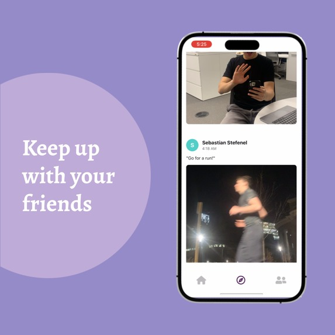
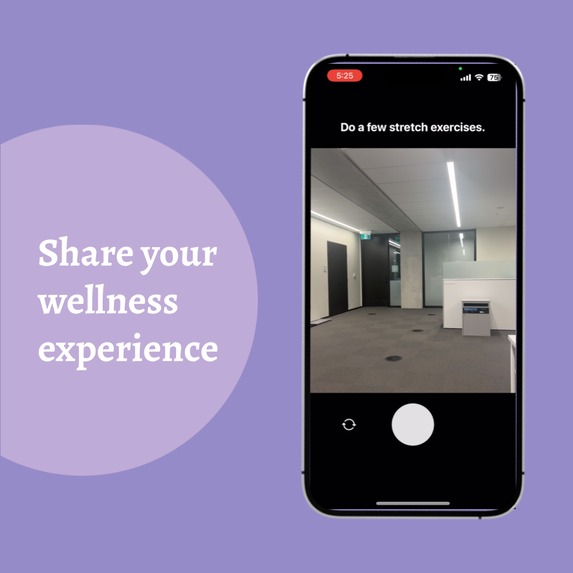
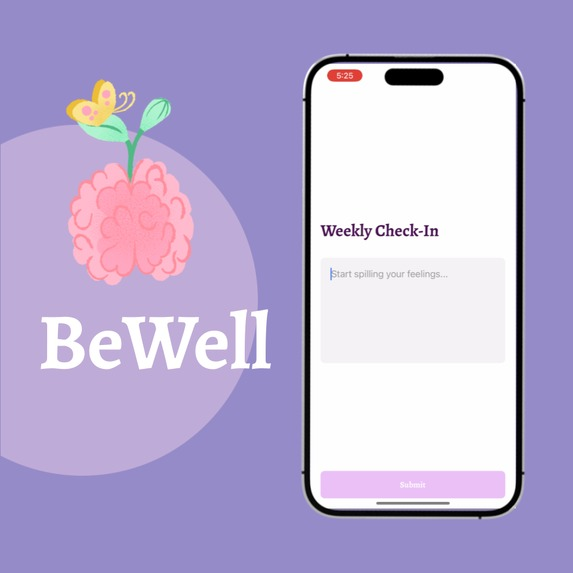

# BeWell 🌸

[Watch the Demo Video](https://www.youtube.com/watch?v=MleEMyMtzH0)

BeWell is a mobile app that promotes mental wellness by helping users take small, meaningful steps each day. Inspired by the spontaneous engagement style of apps like BeReal and the growing need for accessible self-care tools, BeWell provides daily personalized wellness prompts, making it easy to form healthy habits without feeling overwhelmed.

---

## 📱 What It Does

- Sends **daily personalized wellness activity prompts** based on a short survey.
- Encourages users to **complete small tasks** like stretching, gratitude exercises, or a short walk.
- Uses **push notifications** to remind users to stay consistent.
- Applies **AI personalization** to match activities with users' preferences.
- Allows users to **share their wellness activities** with friends and **track each other's progress**.

---

## ⚙️ How We Built It

- **User Engagement** — Crafted notifications that feel like friendly encouragement instead of spammy reminders.
- **React Native + MongoDB** — Developed a cross-platform mobile app with secure data storage.
- **AI & Personalization** — Designed a system that adapts daily prompts to individual user needs.
- **App Architecture** — Structured for scalability and future feature growth.

---

## 💡 Challenges We Ran Into

- **AI Personalization** — Fine-tuning recommendations to feel personal without being overwhelming.
- **Technical Integration** — Smoothly connecting the mobile app with a cloud database.
- **User Retention** — Designing experiences that motivate daily engagement.

---

## 🏆 Accomplishments We're Proud Of

- Successfully implemented real-time AI-powered recommendations.
- Maintained app stability across builds (eventually 😅).
- Learned to integrate complex backend systems with a user-friendly frontend.
- Built something meaningful while surviving countless late-night coding sessions. ☕

---

## 📚 What We Learned

- 🗄 **Database Integration** — Setting up and optimizing a cloud-hosted MongoDB for smooth data flow.
- 🔄 **Cross-Device Syncing** — Keeping user data consistent across multiple devices.
- ⚡ **Performance Optimization** — Ensuring fast and efficient read/write operations for personalized content.
- 🛠 **Scalable Architecture** — Designing a backend that supports future feature expansion.

---

## 🚀 What's Next for BeWell

- 📊 **Deeper AI Personalization** — More adaptive daily prompts based on user progress.
- 🌍 **Community Features** — Connecting users to celebrate and motivate each other.
- 🎖 **Gamification** — Introducing streaks, achievements, and rewards.
- 📅 **Customizable Scheduling** — Letting users pick when to receive their daily prompts.
- 🐛 **Bug Squashing** — Fixing the occasional 3 AM coding "features."

---

## 🛠 Built With

- [Cohere](https://cohere.com/)
- [Expo Go](https://expo.dev/)
- [Express.js](https://expressjs.com/)
- [Google Cloud](https://cloud.google.com/)
- [JavaScript](https://developer.mozilla.org/en-US/docs/Web/JavaScript)
- [MongoDB](https://www.mongodb.com/)
- [React Native](https://reactnative.dev/)
- [TypeScript](https://www.typescriptlang.org/)

---

## 📸 Gallery

| Keep up with your friends | Share your wellness experience |
|:-------------------------:|:------------------------------:|
|  |  |

| Weekly Check-In | Add Friends |
|:---------------:|:-----------:|
|  |  |

